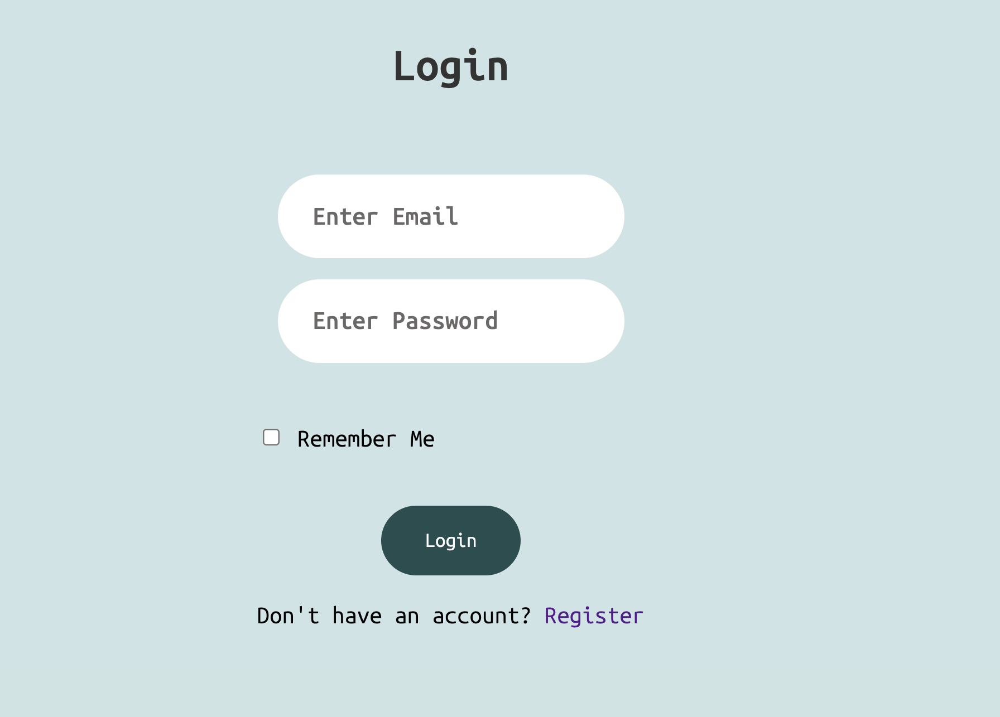
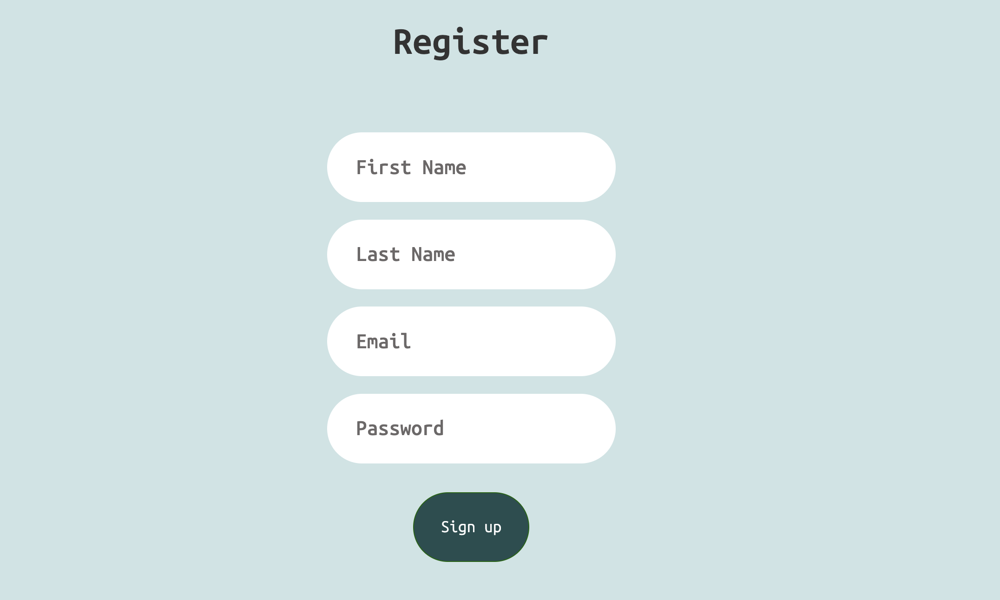
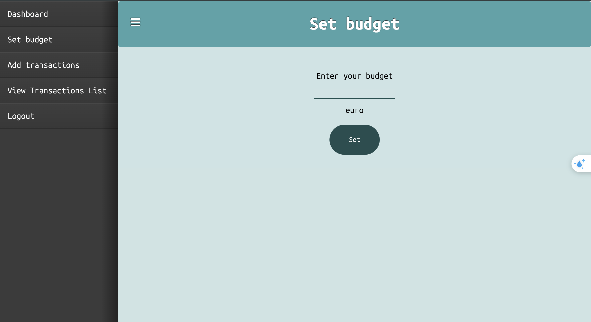
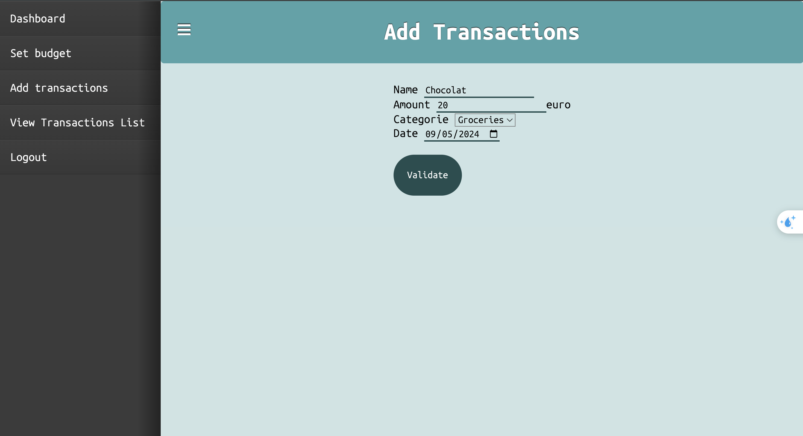
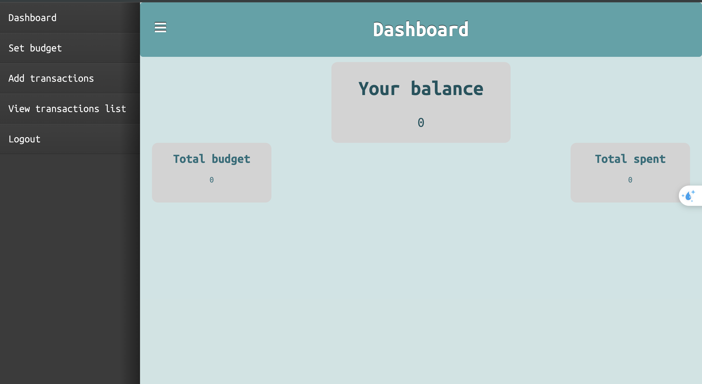
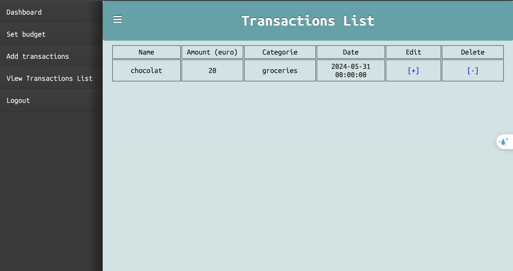

## Budget Management website

#### Student: Phuong Khanh PHAM
###### Bachelor of Computer Science 
***
### Website overview

This website aims to provide a budget management website with PHP, HTML and CSS. It included 6 main pages including the login and register pages. 

- Login page
- Register page
- Dashboard
- Set budget page
- View transaction list page
- Add transaction page

#### Login and Register pages

The Login and Register pages allows users to login and register to access the application.

#### Set budget

This page help users to set their budget. After setting the budget, the user will be redirected to the dashboard.

#### Add transactions

This page contains a form used to add transactions. The user can add Name, Amount, Category and Date of the transaction. After adding the transaction, the user will be redirected to the transaction list, where all the transaction is saved.

#### Dashboard

This page shows Total budget, Total expense and Balance information. Total budget is set by the page 'Set budget'. Total expense is calculated with the sum of all the transactions. Balance is equal to the budget minus the total expense.

#### View transaction list

All transactions will be saved to the transaction list and user can also delete and edit their transactions.
 
